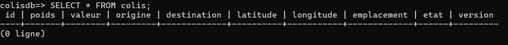
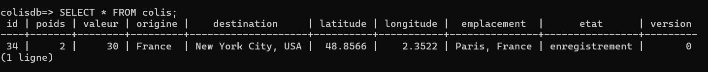

# Projet de Gestion de Colis

## Membres du binôme
- Maxime Rousseau
- Hery Ny aina Rasoamiaramanana

## Choix d'implémentation
- **JPA** pour la persistance des données
- **Servlets** pour la gestion des requêtes HTTP
- **JSP** pour l'affichage des pages web
- **PostgreSQL** comme système de gestion de base de données
- **WildFly** comme serveur d'application

## Prérequis

- Docker et Docker Compose (si vous utilisez Docker pour l'exécution)
- WildFly et PostgreSQL installés manuellement si vous optez pour la configuration sans Docker

## Lancement de l'application avec Docker

1. **Cloner le dépôt Git** : Clonez le dépôt Git sur votre machine :
    ```bash
    git clone [URL_DU_DEPOT_GIT]
    cd [nom_du_repertoire_cloné]
    ```

2. **Lancer l'application avec Docker Compose** :
    Exécutez la commande suivante pour construire et lancer les conteneurs Docker :
    ```bash
    docker-compose up --build
    ```

3. **Accéder à l'application** :
    Une fois démarrée, l'application sera accessible via le navigateur à l'adresse [http://localhost:8080/colis](http://localhost:8080/colis). 

4. **Enregistrement d'un colis** :
    Enregistrez un colis dans l'application avec les informations suivantes :
    - **Poids** : 2 kg
    - **Valeur** : 30.0 €
    - **Origine** : France
    - **Destination** : New York City, USA
    - **Latitude** : 48.8566
    - **Longitude** : 2.3522
    - **Emplacement actuel** : Paris, France

5. **Vérification dans la base de données** :
    Pour voir le colis enregistré, exécutez la commande suivante pour accéder à PostgreSQL :
    ```bash
    docker exec -it postgres-db psql -U tp_colis -d colisdb
    ```
    Ensuite, lancez la commande SQL suivante pour vérifier le colis :
    ```sql
    SELECT * FROM colis;
    ```

## OU configuration manuelle de l'application

### 1. Cloner le dépôt Git
Commencez par cloner le dépôt Git de l'application sur votre machine :
```bash
git clone [URL_DU_DEPOT_GIT]
cd [nom_du_repertoire_cloné]
```

### 2. Configuration de WildFly

#### Installation du driver JDBC PostgreSQL
1. Téléchargez le driver JDBC PostgreSQL (par exemple, `postgresql-42.x.x.jar`).
2. Créez un répertoire `modules/org/postgresql/main` dans le dossier d'installation de WildFly.
3. Copiez le fichier JAR du driver dans ce répertoire.
4. Créez un fichier `module.xml` dans le même répertoire avec le contenu suivant :

    ```xml
    <?xml version="1.0" encoding="UTF-8"?>
    <module xmlns="urn:jboss:module:1.3" name="org.postgresql">
        <resources>
            <resource-root path="postgresql-42.x.x.jar"/>
        </resources>
        <dependencies>
            <module name="javax.api"/>
            <module name="javax.transaction.api"/>
        </dependencies>
    </module>
    ```

#### Modification du fichier standalone.xml
Ajoutez la configuration suivante dans la section `<datasources>` :
    
```xml
<datasource jndi-name="java:jboss/datasources/ColisDS" pool-name="ColisDS" enabled="true" use-java-context="true">
    <connection-url>jdbc:postgresql://localhost:5432/colisdb</connection-url>
    <driver>postgresql</driver>
    <security>
        <user-name>tp_colis</user-name>
        <password>colis</password>
    </security>
</datasource>
<driver name="postgresql" module="org.postgresql">
    <xa-datasource-class>org.postgresql.xa.PGXADataSource</xa-datasource-class>
</driver>
```

Dans la section `<drivers>` :
    
```xml
<driver name="postgresql" module="org.postgresql">
    <xa-datasource-class>org.postgresql.xa.PGXADataSource</xa-datasource-class>
</driver>
```

### 3. Configuration de la base de données PostgreSQL

1. Téléchargez et installez PostgreSQL depuis le site officiel : https://www.postgresql.org/download/.
2. Ajoutez le répertoire `bin` de PostgreSQL aux variables d’environnement de l’utilisateur.
3. Ouvrez PowerShell et naviguez vers le répertoire du projet :
    ```powershell
    cd "C:\Users\[votre_nom]\Desktop\[nom_du_repertoire_cloné]"
    ```
4. Initialisez une nouvelle instance de base de données dans un dossier `data` du répertoire Git cloné :
    ```powershell
    initdb -D "C:\Users\[votre_nom]\Desktop\[nom_du_repertoire_cloné]\data" -U postgres -E UTF8 -A scram-sha-256 --pwfile "password.txt"
    ```
5. Démarrez le serveur PostgreSQL :
    ```powershell
    pg_ctl start -D .\data\
    ```
6. Connectez-vous à PostgreSQL en tant que superutilisateur :
    ```powershell
    psql -U postgres
    ```
7. Lorsqu'on vous demande un mot de passe, entrez "colis".
8. Créez un nouvel utilisateur et une nouvelle base de données :
    ```sql
    CREATE USER tp_colis WITH PASSWORD 'colis';
    CREATE DATABASE colisdb WITH OWNER tp_colis;
    ```
9. Quittez psql avec la commande `\q`, puis reconnectez-vous avec le nouvel utilisateur :
    ```powershell
    psql -U tp_colis -d colisdb
    ```
10. Créez la table `Colis` :
    ```sql
    CREATE TABLE Colis (
        id SERIAL PRIMARY KEY,
        poids DOUBLE PRECISION,
        valeur INT,
        origine VARCHAR(100),
        destination VARCHAR(100),
        latitude DOUBLE PRECISION,
        longitude DOUBLE PRECISION,
        emplacement VARCHAR(100),
        etat VARCHAR(50),
        version INT DEFAULT 0
    );
    ```
11. Vérifiez que la table a été créée correctement :
    ```sql
    \dt
    \d Colis
    ```


## 4. Utilisation de l'application
1. Démarrez le serveur PostgreSQL, puis le serveur WildFly.
2. Déployez l'application (fichier EAR) sur WildFly.
3. Accédez à l'application via un navigateur web à l'adresse : http://localhost:8080/colis
4. Utilisez les différentes fonctionnalités de l'application :
    - **Enregistrement de colis**
    - **Mise à jour de l'état des colis**
    - **Suivi des colis**

## Fonctionnement de l'application

Prenons l'exemple de l'enregistrement du colis suivant :
- **Poids** : 2 kg
- **Valeur** : 30.0 €
- **Origine** : France
- **Destination** : New York City, USA
- **Latitude** : 48.8566
- **Longitude** : 2.3522
- **Emplacement actuel** : Paris, France

### Étapes de vérification et d'enregistrement

1. **Vérifiez la table avant l'enregistrement :**
    Connectez-vous à la base de données et consultez la table `Colis` :
    ```sql
    psql -U tp_colis -d colisdb
    SELECT * FROM colis;
    ```
    Au départ, la table est vide :
    

2. **Enregistrement du colis :**
    Saisissez les informations du colis dans le formulaire d'enregistrement.

3. **Vérifiez les informations enregistrées :**
    Une fois les informations soumises, la table est mise à jour avec le colis ajouté :
    

### Mise à jour d'un colis

Pour mettre à jour un colis existant, spécifiez l'identifiant du colis et modifiez les champs souhaités, par exemple l'état du colis.

### Suivi d'un colis

Pour suivre un colis, sélectionnez son identifiant et consultez son statut actuel et son emplacement.
